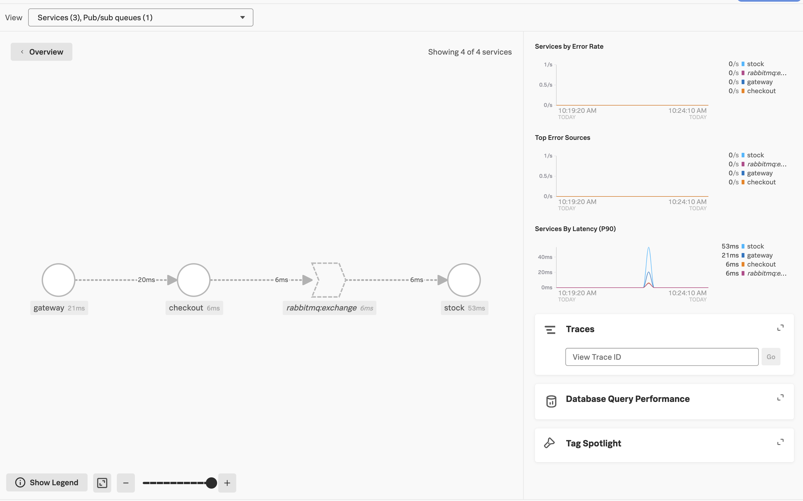
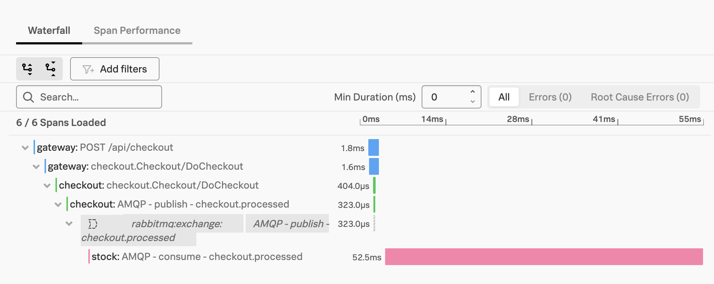

## Open Telemetry in Go example

This service contains a sample on how to use Open Telemetry exposing spans for HTTP, gRPC and AMQP.

You can find the two-series-post with the step by step [here](https://devandchill.com/posts/2021/12/go-step-by-step-guide-for-implementing-tracing-on-a-microservices-architecture-1/2/).

## How to run

Create a .env file in the root directory to send traces to Splunk Observability Cloud:

```
SPLUNK_REALM=<your realm i.e. us0, us1, etc.>
SPLUNK_ACCESS_TOKEN=<your acces token>
SPLUNK_MEMORY_TOTAL_MIB=1024
```

Start services:

```
docker compose up -d --build
```

Produce a trace:

```
curl -X POST localhost:8081/api/checkout
```

## How does it look in Splunk Observability Cloud





